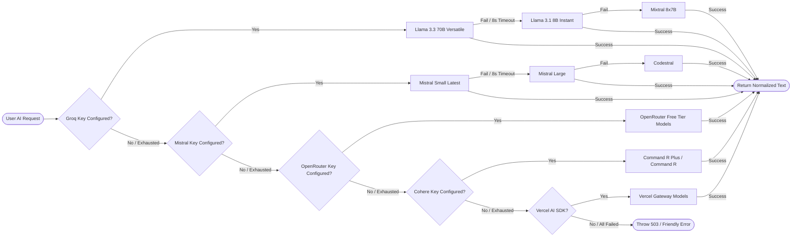

# Brother's Fitness (BroFit)

<div align="center">


**A full-stack gym management ERP, tactical fitness companion, and AI-powered nutrition synthesizer built for Brother's Fitness (Lakhnadon, Madhya Pradesh, India).**

[Live Features](#-system-features--modules) · [Architecture](#-system-architecture) · [Database & RLS](#-database-schema--security-model) · [Environment Variables](#-environment-variables) · [Installation & Setup](#-getting-started) · [API Reference](#-api-routes-reference) · [Security Model](#-security--anti-abuse-hardening)

</div>

---

## 📖 Overview

**BroFit** is a high-performance web platform and administrative ERP engineered for gym operations, member lifecycle management, and tactical trainee support. Built on Next.js 15 App Router, React 19, TypeScript, and Supabase (PostgreSQL), the platform unifies client-facing diagnostic calculators and bilingual AI workout/diet generators with an administrative control suite.

### Key Capabilities

- **Administrative Operations Hub**: Complete member lifecycle tracking (registrations, renewals, photo storage, printable digital receipts, CSV data exports, and automated JSON database backups).
- **Leads Inbox & CRM**: Real-time visitor inquiry processing from the public portal with instant 1-click WhatsApp and cellular dialer integrations.
- **AI Nutrition Synthesizer**: Generates 6-meal daily nutrition protocols and 15-day grocery procurement plans tailored to Indian diets, caloric goals, allergies, and budgets. Powered by a 16-model fallback stack spanning 5 AI providers.
- **IST Quota & Credit Engine**: Atomic daily credit spend and balance reconciliation tied to Indian Standard Time (midnight / 5:30 AM UTC reset).
- **Exercise & Workout Engine**: 800+ exercise movements mapped with animated illustrations and muscle target filters from `free-exercise-db` alongside API Ninjas proxies.
- **Gamification & Engagement**: Client-side visit streak tracking, unlockable achievement medals, motivational quote cycler, and interactive rest timers.
- **Dual-Layer Access Control**: Google OAuth with Row Level Security (RLS) for public trainees; stateless HMAC-SHA256 signed session tokens with Redis-backed revocation for administrators.

---

## 🧩 System Features & Modules

### 1. Gym Administration Suite (`/admin/*`)

| Sub-Module | Path | Key Capabilities |
|---|---|---|
| **Dashboard** | `/admin/dashboard` | Live KPI cards (Active, Expiring ≤7d, Expired, Incomplete profiles), CSV export with formula injection sanitization, birthday alerts with leap-year handling, renewal projected revenue. |
| **Member Directory** | `/admin/members` | Full CRUD operations, instant search, status filter (`active`, `expiring`, `expired`, `incomplete`), card/table view toggle, batch WhatsApp messaging, membership renewal wizard. |
| **Member Form & Storage** | Modal / `/api/admin/upload` | Member registration and profile editing with photo uploads to Supabase Storage bucket `member-photos`. Validated via magic-byte MIME sniffing (JPEG, PNG, WebP, AVIF, GIF up to 5MB). |
| **Digital Receipts** | Modal | Print-ready and shareable membership payment receipts rendered with gym branding, trainer details, and WhatsApp delivery. |
| **Leads Inbox** | `/admin/leads` | Real-time contact submissions with unread counters, local read-state tracking (capped to 500 IDs), and 1-click WhatsApp/Call response triggers. |
| **Financial Analytics** | `/admin/analytics` | 12-month revenue bar chart with member drilldown, plan popularity by revenue vs. member share, and 6-month joining cohort retention health. |
| **Activity Audit Log** | `/admin/activity` | Immutable event trail recording all `CREATE`, `UPDATE`, `DELETE`, `LOGIN`, `LOGOUT`, and `BACKUP` actions with IP and client metadata. |
| **System Settings & Backups** | `/admin/settings` | Canonical plan pricing table, business configuration inspection, and 1-click JSON database snapshot export with mirrored upload to Supabase `backups` bucket. |

### 2. Trainee Tools & Nutrition (`/fuel`, `/calculators`, `/workouts`)

- **Bilingual AI Diet Generator (`/fuel`, `/api/generate-diet`)**:
  - Implements Mifflin-St Jeor TDEE equation with user biometrics (Age, Gender, Height, Weight, Activity Factor).
  - Configurable surplus/deficit targets (0.25 kg/wk, 0.5 kg/wk, 1.0 kg/wk).
  - Synthesizes 6 distinct meals (Early Morning, Breakfast, Mid-Morning Snack, Lunch, Evening Snack, Dinner) with precise macro breakdowns (Protein, Carbs, Fats, Calories).
  - Produces a 15-day organized grocery shopping list and cooking guidelines.
  - Full Hindi and English bilingual rendering with client-side PDF export via `html2canvas` and `jsPDF`.
- **Tactical AI Fitness Chatbot (`TacticalChatbot.tsx`, `/api/chat`)**:
  - Context-aware fitness and nutrition assistant supporting English and Hinglish queries.
  - Daily credit quota enforcement (5 daily credits default).
- **Fitness Diagnostics (`/calculators`, `Diagnostics.tsx`)**:
  - **BMI Calculator**: Body Mass Index score with category classification and weight adjustment recommendations.
  - **TDEE Calculator**: Calorie expenditure breakdown showing Maintenance, Cutting (-500 kcal), and Bulking (+500 kcal) targets.
  - **1RM Calculator**: One Rep Max estimation using Brzycki and Epley algorithms with a 70%–95% load breakdown table.
  - **Mission Report Generator**: Exportable image summaries of Trainee diagnostic reports for social sharing.
- **Workout & Exercise Library (`/workouts`, `WorkoutLibrary.tsx`)**:
  - 800+ exercise directory fetched from `free-exercise-db` via GitHub raw CDN with client-side fuzzy search via `fuzzysort`.
  - Muscle group taxonomy filtering (Chest, Back, Legs, Arms, Shoulders, Core, Cardio, Strength, Stretching).
  - Tactical Stopwatch & Rest Countdown timer (`TacticalStopwatch.tsx`) featuring audio alerts and haptic vibration feedback.

### 3. Community, Engagement & Gamification

- **Trophy Room (`/trophy-room`, `GamificationContext.tsx`)**:
  - Daily visit streak counter stored in `localStorage`.
  - Unlockable achievement medals: `ROOKIE_RECRUIT` (Welcome), `IRON_ADDICT` (7-Day Streak), `DIET_TACTICIAN` (Diet Plan Generated), `CALCULATOR_ELITE` (Diagnostic Usage).
- **Daily Protocol Split (`DailyProtocol.tsx`)**:
  - Switchable workout protocols: **Bro Split** (Single muscle per day) vs. **Triple Split** (Push / Pull / Legs compound split) with automatic active day indicators.
- **Quote Cycler (`/quotes`)**:
  - Categorized motivational quote explorer (Discipline, Strength, Mindset, Recovery, Hustle, Indian Wisdom) with audio playback and favorites curation.
- **Public Hero & Real-Time Stats (`Hero.tsx`, `/api/public/member-count`)**:
  - Live active member counter and dynamic 4-month quarterly trend chart.

---

## 🏗️ System Architecture

```
┌──────────────────────────────────────────────────────────────────────────────────────────────────┐
│                                       BROFIT SYSTEM TOPOLOGY                                     │
├──────────────────────────────────────────────────────────────────────────────────────────────────┤
│                                                                                                  │
│   PUBLIC TRAINEES (Web / PWA)                        ADMINISTRATORS (Management Console)         │
│   • Google OAuth Sign-In                             • Passcode Authentication (Master Secret)   │
│   • Trainee Profile & AI Credits                     • HMAC-SHA256 Bearer Token (24h TTL)        │
│   • Diet Synthesizer & Chatbot                       • Member CRUD, Leads CRM, Audit, Backups    │
│                  │                                                      │                        │
│                  ▼                                                      ▼                        │
│   ┌──────────────────────────────────────────────────────────────────────────────────────────┐   │
│   │                               NEXT.JS 15 APP ROUTER RUNTIME                              │   │
│   │                                                                                          │   │
│   │   [PUBLIC & TRAINEE API ROUTES]               [ADMIN PROTECTED ROUTES (/api/admin/*)]    │   │
│   │   • /api/chat        • /api/contact           • requireAdminToken() Guard                │   │
│   │   • /api/generate-diet                        • /api/admin/login     • /api/admin/backup │   │
│   │   • /api/exercises/ninjas                     • /api/admin/members   • /api/admin/upload │   │
│   │   • /api/public/member-count                  • /api/admin/leads     • /api/admin/logout │   │
│   │   • /api/rate-limit-status                    • /api/admin/activity-logs                 │   │
│   │   • /api/health                               • /api/admin/verify                        │   │
│   │                                                                                          │   │
│   │   [CRON ROUTE]                                                                           │   │
│   │   • /api/cron/monthly-revenue (Protected by CRON_SECRET & timingSafeEqual)                │   │
│   └───────────────┬──────────────────────────┬───────────────────────────────┬───────────────┘   │
│                   │                          │                               │                   │
│                   ▼                          ▼                               ▼                   │
│   ┌───────────────────────────────┐ ┌───────────────────────────────┐ ┌──────────────────────┐  │
│   │       SUPABASE POSTGRES       │ │      UPSTASH REDIS / MEM      │ │  AI FALLBACK ENGINE  │  │
│   │ • public.users (RLS)          │ │ • Sliding-Window Rate Limit   │ │ 1. Groq (Llama 3.3)  │  │
│   │ • public.gym_members          │ │ • Admin Revocation Blacklist  │ │ 2. Mistral AI        │  │
│   │ • public.contact_submissions  │ │   (brofit:admin:revoked-      │ │ 3. OpenRouter        │  │
│   │ • public.admin_activity_logs  │ │    nonces set)                │ │ 4. Cohere            │  │
│   │ • public.app_settings         │ │                               │ │ 5. Vercel AI         │  │
│   │ • Storage: member-photos,     │ │                               │ │ (8s call timeout /   │  │
│   │   backups                     │ │                               │ │  60s total deadline) │  │
│   │ • RPC: spend_user_credit()    │ │                               │ │                      │  │
│   │ • RPC: reset_daily_credits()  │ │                               │ │                      │  │
│   └───────────────────────────────┘ └───────────────────────────────┘ └──────────────────────┘  │
│                                                                                                  │
└──────────────────────────────────────────────────────────────────────────────────────────────────┘
```

---

## 🔐 Authentication & Access Control

BroFit uses two independent, segregated authentication boundaries:

```mermaid
flowchart TD
    subgraph MemberAuth["Member / Trainee Auth (Supabase Google OAuth)"]
        A[Trainee initiates Sign-In] --> B[Supabase Google OAuth Provider]
        B --> C[Receive Supabase JWT Session Token]
        C --> D[Client sends Bearer JWT in API Calls]
        D --> E[Server: supabase.auth.getUser token]
        E --> F[Resolve user.id and check public.users]
        F --> G[Execute Atomic Credit Deduction via RPC]
    end

    subgraph AdminAuth["Admin Auth (Stateless HMAC-SHA256)"]
        H[Admin Submits Passcode] --> I[POST /api/admin/login]
        I --> J[timingSafeEqual verification vs ADMIN_PASSWORD]
        J --> K[Generate HMAC-SHA256 Token with 24h Expiry & Nonce]
        K --> L[Client stores Token in sessionStorage]
        L --> M[requireAdminToken guard verifies signature & Redis blacklist]
        M --> N[Authorize Service-Role Supabase Access]
    end
```



### 1. Trainee Authentication
- **Mechanism**: Google OAuth handled through `@supabase/supabase-js`.
- **Identity Binding**: The `public.users` table is mapped directly to `auth.uid() = id`.
- **Row Level Security (RLS)**: Trainees can strictly `SELECT`, `INSERT`, and `UPDATE` their own profile and credit records.
- **Credit Enforcement**: API endpoints verify the Supabase JWT on the server and invoke the atomic PostgreSQL stored procedure `spend_user_credit(p_uid, p_max)`.

### 2. Administrator Authentication
- **Mechanism**: Single master passcode verified against `ADMIN_PASSWORD` (or `ADMIN_TOKEN_SECRET`) using `crypto.timingSafeEqual` to prevent timing side-channel attacks.
- **Token Format**: Stateless signed token structured as `<base64url(payload)>.<signature>`, containing `iat`, `exp` (24-hour lifetime), and a cryptographically random `nonce`.
- **Client Storage**: Stored exclusively in `sessionStorage` (scoped to the active browser tab, automatically wiped on tab closure).
- **Dual-Layer Revocation**: When an admin logs out via `/api/admin/logout`, the token's nonce is blacklisted in both an in-memory `Set` and an Upstash Redis set (`brofit:admin:revoked-nonces`) with automatic 24-hour TTL expiration.

---

## 🤖 Multi-Provider AI Fallback Engine

All AI capabilities (Diet Synthesis and Tactical Chat) route through `lib/ai-provider.ts`, which orchestrates a resilient 16-model cascade across 5 providers.



- **Per-Call Timeout**: 8,000 ms per model attempt to prevent serverless execution stalls.
- **Total Fallback Deadline**: 60,000 ms across the entire cascade.
- **Fail-Fast Detection**: Providers without configured API keys in environment variables are skipped instantaneously with zero network overhead.
- **JSON Schema Validation**: Structured responses for nutrition plans are validated against Zod schemas (`DietResponseSchema`) with automated recovery for escaped or malformed JSON blocks.

---

## 💳 Quota & Credit Management Engine

Trainee AI generations are governed by an Indian Standard Time (IST) credit system:

```
┌──────────────────────────────────────────────────────────────────────────────────────────────────┐
│                                      IST CREDIT SPEND CYCLE                                      │
├──────────────────────────────────────────────────────────────────────────────────────────────────┤
│                                                                                                  │
│   1. Request Arrives at /api/generate-diet or /api/chat with Bearer User JWT                     │
│   2. Server validates token via supabase.auth.getUser() -> obtains userId                        │
│   3. Fetch current user state from public.users:                                                 │
│      • If last_credit_reset < istToday() -> Display credits as MAX_DAILY_CREDITS (default 5)     │
│      • Else -> Display remaining stored daily_credits                                            │
│   4. Server invokes Supabase RPC: spend_user_credit(p_uid, p_max)                                │
│      • Stored Procedure executes atomically inside PostgreSQL transaction:                       │
│        - If last_credit_reset != CURRENT_DATE AT TIME ZONE 'Asia/Kolkata':                       │
│            daily_credits := p_max - 1, last_credit_reset := IST Today                            │
│        - Else if daily_credits > 0:                                                              │
│            daily_credits := daily_credits - 1                                                    │
│        - Else:                                                                                   │
│            RAISE EXCEPTION 'INSUFFICIENT_CREDITS' (returns 402)                                  │
│   5. Transient Network Failure Reconciliation:                                                   │
│      • If RPC call drops, server re-verifies balance before retrying to prevent double-deduction.│
│   6. Background Cron Reset:                                                                      │
│      • Scheduled reset_daily_credits() procedure runs at 5:30 AM IST (Midnight IST boundary)    │
│        reading cap dynamically from public.app_settings.max_daily_credits.                       │
│                                                                                                  │
└──────────────────────────────────────────────────────────────────────────────────────────────────┘
```

---

## 🗄️ Database Schema & Security Model

The database runs on Supabase PostgreSQL with strict Row Level Security (RLS) policies.

### Tables Overview

```
                               ┌─────────────────────────┐
                               │       auth.users        │
                               └────────────┬────────────┘
                                            │ 1:1 (id)
                                            ▼
┌─────────────────────────┐    ┌─────────────────────────┐    ┌─────────────────────────┐
│      app_settings       │    │      public.users       │    │   contact_submissions   │
├─────────────────────────┤    ├─────────────────────────┤    ├─────────────────────────┤
│ key (TEXT, PK)          │    │ id (UUID, PK -> auth)   │    │ id (UUID, PK)           │
│ value (TEXT)            │    │ email (TEXT)            │    │ name (TEXT)             │
│ description (TEXT)      │    │ full_name (TEXT)        │    │ email (TEXT)            │
│ updated_at (TIMESTAMPTZ)│    │ avatar_url (TEXT)       │    │ phone (TEXT)            │
└─────────────────────────┘    │ daily_credits (INT)     │    │ message (TEXT)          │
                               │ last_credit_reset (DATE)│    │ created_at (TIMESTAMPTZ)│
                               │ created_at (TIMESTAMPTZ)│    └─────────────────────────┘
                               │ updated_at (TIMESTAMPTZ)│
                               └─────────────────────────┘
                                            
┌────────────────────────────────────────────────────────┐    ┌─────────────────────────┐
│                  public.gym_members                    │    │  admin_activity_logs    │
├────────────────────────────────────────────────────────┤    ├─────────────────────────┤
│ id (UUID, PK)                                          │    │ id (UUID, PK)           │
│ full_name (TEXT)             membership_type (TEXT)    │    │ action_type (TEXT)      │
│ mobile (TEXT)                membership_start (DATE)   │    │ member_name (TEXT)      │
│ email (TEXT)                 membership_end (DATE)     │    │ member_id (UUID)        │
│ date_of_birth (DATE)         photo_url (TEXT)          │    │ admin_id (TEXT)         │
│ gender (TEXT)                notes (TEXT)              │    │ ip_address (TEXT)       │
│ height_cm (NUMERIC)          created_at (TIMESTAMPTZ)  │    │ user_agent (TEXT)       │
│ weight_kg (NUMERIC)          updated_at (TIMESTAMPTZ)  │    │ details (JSONB)         │
│ address (TEXT)                                         │    │ created_at (TIMESTAMPTZ)│
└────────────────────────────────────────────────────────┘    └─────────────────────────┘
```

### Row Level Security (RLS) Policy Matrix

| Table | Role / Target | Allowed Operations | Policy Definition / Access Rules |
|---|---|---|---|
| `public.users` | `authenticated` (Owner) | `SELECT`, `INSERT`, `UPDATE` | `auth.uid() = id` (Users can only view and update their own record). |
| `public.users` | `anon` | None | Access denied. |
| `public.gym_members` | `anon` / `authenticated` | None | All direct public access revoked. Accessible strictly via backend service-role key. |
| `public.contact_submissions` | `anon` / `public` | `INSERT` only | Unauthenticated visitors can submit contact forms; `SELECT`, `UPDATE`, `DELETE` are revoked. |
| `public.admin_activity_logs` | `anon` / `authenticated` | None | Restricted entirely to server-side service-role client. |
| `public.app_settings` | `anon` / `authenticated` | None | Restricted entirely to server-side service-role client. |

### Supabase Storage Buckets
- `member-photos`: Public read access for avatar images; uploads restricted to admin API routes using service-role authorization.
- `backups`: Private administrative storage containing encrypted/raw JSON database snapshots.

---

## 🛡️ Security & Anti-Abuse Hardening

1. **Constant-Time Verification**:
   - `crypto.timingSafeEqual` is enforced on admin passcode validation (`/api/admin/login`) and cron secret verification (`/api/cron/monthly-revenue`) to eliminate timing side-channel attacks.
2. **Distributed Sliding-Window Rate Limiting**:
   - Implemented via `@upstash/ratelimit` with seamless fallback to an in-memory sliding window for development environments.
   - Login preset: `5 requests / 15 minutes` per IP.
   - Contact form preset: `3 requests / 1 hour` per IP.
   - Anti-Spoofing: Proxy headers (`x-real-ip`, `x-forwarded-for`) are only honored when running in trusted environments (`VERCEL=1` or `TRUST_PROXY_HEADERS=true`), taking the rightmost IP in forwarding chains.
3. **Magic-Byte File Upload Validation (`/api/admin/upload`)**:
   - Validates the first 8-12 bytes of uploaded binary buffers to verify true image formats (JPEG `FF D8 FF`, PNG `89 50 4E 47`, WebP `RIFF...WEBP`, AVIF `ftypavif`, GIF `GIF87a/89a`). Rejects client-spoofed MIME headers.
4. **CSV Injection Formula Neutralization**:
   - In administrative CSV exports (`/admin/dashboard` & `/admin/members`), all cell values starting with `= `, `+`, `-`, `@`, `\t`, `\r`, or `\n` are sanitized with leading tab delimiters.
5. **Contact Form Honeypot Protection**:
   - Forms include a hidden `_honeypot` field. Automated bots filling this field receive a deceptive `{ success: true }` while data insertion is silently dropped.
6. **Request Tracing & Structured Logging**:
   - Request IDs (`x-request-id`) are minted or sanitized as UUIDs via `lib/request-id.ts` and propagated through child loggers (`lib/logger.ts`) as structured JSON in production.
7. **HTTP Security Headers (`next.config.mjs`)**:
   - Configured with `X-Content-Type-Options: nosniff`, `X-Frame-Options: DENY`, `X-XSS-Protection: 1; mode=block`, `Referrer-Policy: strict-origin-when-cross-origin`, and `Permissions-Policy`.

---

## 🌐 API Routes Reference

### Administrator Endpoints (Requires `Authorization: Bearer <admin_token>`)

| Method | Endpoint | Description |
|---|---|---|
| `POST` | `/api/admin/login` | Authenticates admin password; returns signed HMAC session token. Rate-limited (5/15m). |
| `POST` | `/api/admin/logout` | Revokes admin token by placing its nonce into the Redis/memory blacklist. |
| `GET` | `/api/admin/verify` | Validates session token validity on admin route navigation. |
| `GET` | `/api/admin/members` | Fetches members with search, pagination (`page`, `pageSize`), and sorting (`newest`, `oldest`, `name`). |
| `POST` | `/api/admin/members` | Creates a new gym member record. Logs activity in audit trail. |
| `PUT` | `/api/admin/members` | Updates an existing member record. Logs field changes in audit trail. |
| `DELETE` | `/api/admin/members` | Deletes a member record and cleans up associated photo assets from Supabase Storage. |
| `GET` | `/api/admin/leads` | Retrieves contact form submissions ordered newest first. |
| `DELETE` | `/api/admin/leads` | Deletes a lead submission by ID. |
| `GET` | `/api/admin/activity-logs` | Fetches immutable administrative audit logs. |
| `POST` | `/api/admin/upload` | Uploads member avatar (max 5MB, magic-byte verified) to `member-photos` bucket. |
| `POST` | `/api/admin/backup` | Generates full member database JSON snapshot and uploads to `backups` bucket. |

### Public & Trainee Endpoints

| Method | Endpoint | Description |
|---|---|---|
| `POST` | `/api/chat` | AI fitness chatbot conversation. Validates Trainee JWT and spends 1 credit atomically. |
| `POST` | `/api/generate-diet` | Synthesizes 6-meal Indian nutrition protocol. Validates Trainee JWT and spends 1 credit. |
| `POST` | `/api/contact` | Ingests contact inquiries. Protected by rate limiting (3/1h) and honeypot field. |
| `GET` | `/api/public/member-count` | Returns live active member count and 4-month quarterly trend data. |
| `GET` | `/api/rate-limit-status` | Returns authoritative remaining AI credits for the authenticated user. |
| `GET` | `/api/exercises/ninjas` | Server proxy for API Ninjas exercise directory with 1-hour cache. |
| `GET` | `/api/health` | Service liveness probe. |

### Cron & Scheduled Jobs

| Method | Endpoint | Description |
|---|---|---|
| `GET` | `/api/cron/monthly-revenue` | Computes calendar-month revenue, plan breakdown, and churn. Protected by `Bearer <CRON_SECRET>`. |

---

## 💻 Tech Stack

| Category | Technology | Version | Purpose |
|---|---|---|---|
| **Framework** | [Next.js](https://nextjs.org/) | `15.5.23` | App Router, Server Components, API route handlers, serverless execution. |
| **UI Library** | [React](https://react.dev/) | `19.0.0` | Component framework and hooks. |
| **Language** | [TypeScript](https://www.typescriptlang.org/) | `5.0` | Static typing in strict mode across client and server. |
| **Database & Auth** | [Supabase](https://supabase.com/) | `2.89.0` | PostgreSQL database, Google OAuth authentication, RLS, Storage. |
| **Styling** | [Tailwind CSS](https://tailwindcss.com/) | `3.4.1` | Utility-first styling, responsive layouts, and custom design tokens. |
| **State & Cache** | [SWR](https://swr.vercel.app/) | `2.3.9` | Client data fetching, caching, and optimistic UI updates. |
| **Rate Limiting** | [Upstash Redis](https://upstash.com/) | `2.0.8` | Distributed sliding-window rate limiting and token revocation blacklist. |
| **Validation** | [Zod](https://zod.dev/) | `3.24.2` | Runtime schema validation for forms, APIs, and AI responses. |
| **AI Integration** | [OpenAI SDK](https://github.com/openai/openai-node) / [Cohere](https://cohere.com/) | `6.15.0` / `7.19.0` | Unified multi-provider AI communication clients. |
| **PWA Support** | [@ducanh2912/next-pwa](https://github.com/ducanh2912/next-pwa) | `10.2.9` | Service worker registration, offline shell caching, update toasts. |
| **Exporting** | [jsPDF](https://github.com/parallax/jsPDF) / [html2canvas](https://html2canvas.hertzen.com/) | `4.2.1` / `1.4.1` | Trainee diet plan and diagnostic report PDF rendering. |
| **Testing** | [Vitest](https://vitest.dev/) / Testing Library | `4.1.11` | Unit and integration test suite with V8 code coverage. |

---

## 📁 Repository Directory Structure

```
brofit/
├── .github/
│   └── workflows/
│       └── ci.yml               # GitHub Actions CI workflow (lint + test + coverage)
├── __tests__/                   # Unit and integration test suite
│   ├── admin-auth.test.ts       # requireAdminToken guard tests
│   ├── ai.test.ts               # Multi-provider fallback cascade tests
│   ├── auth.test.ts             # HMAC token creation, validation, revocation tests
│   ├── credit-service.test.ts   # Credit spend and token verification tests
│   ├── fitness-data-service.test.ts # Exercise cache and API proxy tests
│   ├── lib.test.ts              # Rate limiter, proxy headers, and business config tests
│   ├── logger.test.ts           # Structured JSON logger tests
│   ├── member-utils.test.ts     # IST date calculations and birthday countdown tests
│   ├── members-route.test.ts    # Admin members API pagination and search tests
│   ├── request-id.test.ts       # UUID tracing and header injection tests
│   ├── retry.test.ts            # Exponential backoff and retryableQuery tests
│   ├── setup.ts                 # Vitest test environment initialization
│   ├── supabase.test.ts         # Singleton client factory tests
│   ├── utils.test.ts            # Tailwind class merger tests
│   └── validation.test.ts       # Zod schema validation tests
├── app/                         # Next.js 15 App Router structure
│   ├── admin/                   # Admin management console pages
│   │   ├── activity/            # Audit logs view
│   │   ├── analytics/           # Financial & retention analytics
│   │   ├── dashboard/           # Main admin command dashboard
│   │   ├── leads/               # Visitor inquiries inbox
│   │   ├── login/               # Admin passcode authentication
│   │   ├── members/             # Member directory & management
│   │   └── settings/            # System configuration & backups
│   ├── api/                     # Backend serverless API routes
│   │   ├── admin/               # Admin-protected endpoints (HMAC auth)
│   │   │   ├── activity-logs/   # Audit log retrieval
│   │   │   ├── backup/          # JSON database snapshot export
│   │   │   ├── leads/           # Leads management
│   │   │   ├── login/           # Admin passcode login
│   │   │   ├── logout/          # Admin token revocation
│   │   │   ├── members/         # Member CRUD operations
│   │   │   ├── upload/          # Magic-byte validated photo upload
│   │   │   └── verify/          # Admin token verification
│   │   ├── chat/                # AI fitness chatbot endpoint
│   │   ├── contact/             # Public contact form submission
│   │   ├── cron/                # Scheduled jobs (monthly revenue)
│   │   ├── exercises/ninjas/    # Exercise data proxy
│   │   ├── generate-diet/       # AI diet synthesizer endpoint
│   │   ├── health/              # Service health probe
│   │   ├── public/member-count/ # Public live member count
│   │   └── rate-limit-status/   # Trainee credit balance inquiry
│   ├── calculators/             # Diagnostic fitness calculators page
│   ├── fuel/                    # AI diet synthesizer page
│   ├── pricing/                 # Membership plans & pricing page
│   ├── quotes/                  # Motivational quote explorer page
│   ├── trophy-room/             # Trainee achievements & streak page
│   ├── workouts/                # Exercise library & stopwatch page
│   ├── globals.css              # Global styles & CSS variables
│   ├── layout.tsx               # Root layout, theme script, SEO metadata
│   └── page.tsx                 # Public landing page
├── components/                  # UI Components
│   ├── admin/                   # Admin UI modals, layouts, and cards
│   ├── animations/              # Micro-animations & animated icons
│   ├── features/                # Domain-specific feature components
│   ├── fuel/                    # Diet result views, PDF export handlers
│   ├── public/                  # Public website sections (Hero, Navbar, Footer)
│   └── ui/                      # Base primitives, providers, and modals
├── docs/
│   └── bug-audit.md             # Codebase audit findings and fix registry
├── hooks/                       # Custom React hooks (useAdminStats, useModalDismiss)
├── lib/                         # Core business logic and server utilities
│   ├── admin-api.ts             # Admin client fetch wrapper & WhatsApp builders
│   ├── admin-auth.ts            # Server-side requireAdminToken guard
│   ├── ai-provider.ts           # 16-model multi-provider fallback engine
│   ├── auth.ts                  # HMAC-SHA256 token signer & blacklist
│   ├── auth-context.tsx         # Admin authentication React context
│   ├── config.ts                # Canonical business rules, plans, prices, constants
│   ├── credit-service.ts        # Trainee token verification & atomic RPC spend
│   ├── fitness-data-service.ts  # Free-exercise-db and API Ninjas integrations
│   ├── fuel-types.ts            # TypeScript interfaces for nutrition plans
│   ├── logger.ts                # Structured JSON production logger
│   ├── member-utils.ts          # IST timezone date math and status helpers
│   ├── rate-limit.ts            # Upstash Redis & in-memory sliding-window limiter
│   ├── request-id.ts            # Request ID minting & propagation
│   ├── retry.ts                 # Transient error detection & backoff retry
│   ├── server-supabase.ts       # Service-role Supabase client singleton
│   ├── supabase.ts              # Public anon Supabase client singleton
│   ├── user-auth-context.tsx    # Trainee Google OAuth React context
│   ├── utils.ts                 # cn() class utility merger
│   └── validation.ts            # Zod validation schemas
├── public/                      # Static assets, PWA icons, manifest.json
├── supabase/
│   └── migrations/              # PostgreSQL schema definitions & SQL migrations
│       ├── supabase-schema.sql  # Users schema, spend_user_credit RPC
│       ├── 2026-08-01-admin-tables.sql       # Members, leads, audit tables
│       └── 2026-08-02-configurable-credits.sql # Configurable credit caps
├── .env.local.example           # Environment variables template
├── components.json              # Shadcn UI configuration
├── eslint.config.mjs            # ESLint configuration
├── next.config.mjs              # Next.js & PWA Workbox configuration
├── package.json                 # Project dependencies & scripts
├── tailwind.config.ts           # Tailwind CSS theme configuration
├── tsconfig.json                # TypeScript compiler configuration
└── vitest.config.ts             # Vitest test configuration & coverage rules
```

---

## 🔑 Environment Variables

Create a `.env.local` file in the root directory modeled after `.env.local.example`:

| Variable | Client / Server | Required | Default | Description |
|---|---|---|---|---|
| `NEXT_PUBLIC_SUPABASE_URL` | Client & Server | **Yes** | — | Supabase project HTTPS URL (`https://<project>.supabase.co`). |
| `NEXT_PUBLIC_SUPABASE_ANON_KEY` | Client & Server | **Yes** | — | Supabase public anonymous API key for public client queries. |
| `SUPABASE_SERVICE_ROLE_KEY` | Server Only | **Yes** | — | Supabase service-role secret key. Bypasses RLS for admin operations and atomic credit spend. |
| `ADMIN_PASSWORD` | Server Only | **Yes** | — | Master passcode used for administrative authentication and HMAC token signing. |
| `CRON_SECRET` | Server Only | **Yes** | — | Hex secret used to protect scheduled cron routes (`/api/cron/monthly-revenue`). |
| `GROQ_API_KEY` | Server Only | *Recommended* | — | API key for Groq Cloud (primary high-speed AI provider). |
| `MISTRAL_API_KEY` | Server Only | *Optional* | — | API key for Mistral AI (secondary fallback AI provider). |
| `OPENROUTER_API_KEY` | Server Only | *Optional* | — | API key for OpenRouter (tertiary fallback AI provider). |
| `COHERE_API_KEY` | Server Only | *Optional* | — | API key for Cohere (quaternary fallback AI provider). |
| `API_NINJAS_KEY` | Server Only | *Optional* | — | API key for API Ninjas exercise directory proxy. |
| `UPSTASH_REDIS_REST_URL` | Server Only | *Optional* | — | Upstash Redis REST endpoint for distributed rate limiting & token revocation. |
| `UPSTASH_REDIS_REST_TOKEN` | Server Only | *Optional* | — | Upstash Redis REST authentication token. |
| `TRUST_PROXY_HEADERS` | Server Only | *Optional* | `false` | Set to `true` when operating behind a reverse proxy (auto-enabled on Vercel). |
| `MAX_DAILY_CREDITS` | Server Only | *Optional* | `5` | Daily AI credit cap granted to registered trainees. |
| `NEXT_PUBLIC_SITE_URL` | Client & Server | *Optional* | `https://brothersfitness.in` | Canonical URL used for OpenGraph and PWA metadata. |

---

## 🚀 Getting Started

### Prerequisites
- **Node.js**: `v20.x` or later.
- **Package Manager**: `npm` (v10+).
- **Supabase**: Active Supabase project with PostgreSQL database.
- **AI Keys** (Optional): At least one key (`GROQ_API_KEY` recommended).
- **Upstash Redis** (Optional): For distributed rate limiting in multi-region deployments.

### Step-by-Step Installation

1. **Clone the Repository**:
   ```bash
   git clone https://github.com/4nur4gmishr4/BrothersFitness.git
   cd BrothersFitness
   ```

2. **Install Dependencies**:
   ```bash
   npm install
   ```

3. **Configure Environment Variables**:
   ```bash
   cp .env.local.example .env.local
   ```
   Generate strong secrets for administrative authentication and cron operations:
   ```bash
   # Generate secure ADMIN_PASSWORD
   openssl rand -base64 32

   # Generate secure CRON_SECRET
   openssl rand -hex 32
   ```

4. **Initialize Database Schema**:
   Execute the migration SQL scripts located in `supabase/migrations/` in chronological order via the Supabase SQL Editor or Supabase CLI:
   - `supabase/migrations/supabase-schema.sql` (Creates `users` table and `spend_user_credit` RPC)
   - `supabase/migrations/2026-08-01-admin-tables.sql` (Creates `gym_members`, `contact_submissions`, `admin_activity_logs`)
   - `supabase/migrations/2026-08-02-configurable-credits.sql` (Creates `app_settings` and configurable credit procedures)

   Create the required Supabase Storage buckets:
   - `member-photos` (Public bucket for trainee avatars)
   - `backups` (Private bucket for database JSON snapshots)

5. **Run the Development Server**:
   ```bash
   npm run dev
   ```
   Access the web application at [http://localhost:3000](http://localhost:3000) and the administrative panel at [http://localhost:3000/admin/login](http://localhost:3000/admin/login).

---

## 📜 Available NPM Scripts

| Command | Action |
|---|---|
| `npm run dev` | Starts the Next.js development server on `http://localhost:3000` with hot-module reloading. |
| `npm run build` | Compiles the production application bundle and generates PWA service worker assets. |
| `npm run start` | Starts the production server using the compiled `.next` build. |
| `npm run lint` | Executes ESLint to check for code style issues and static syntax errors. |
| `npm run test` | Runs the Vitest test suite once across all unit and integration test files. |
| `npm run test:watch` | Starts Vitest in interactive watch mode for test-driven development. |
| `npm run test:coverage` | Executes tests and generates a V8 coverage report enforcing configured thresholds. |

---

## 🧪 Testing & Quality Assurance

The repository includes a comprehensive test suite powered by [Vitest](https://vitest.dev/) and `@testing-library/react`.

```bash
# Execute test suite
npm test

# Generate coverage report
npm run test:coverage
```

### Coverage Thresholds (Enforced on `lib/**/*.ts`)
- **Statements**: Minimum 80%
- **Functions**: Minimum 80%
- **Lines**: Minimum 80%
- **Branches**: Minimum 70%

---

## 📱 Progressive Web App (PWA)

BroFit is configured as an installable Progressive Web App via `@ducanh2912/next-pwa` in `next.config.mjs`.

- **Service Worker Lifecycle**: Configured with `skipWaiting: false` inside `workboxOptions`. New service worker updates wait for user confirmation via the `PwaUpdateToast` reload prompt, eliminating mid-session chunk-load errors.
- **Caching Strategy**: Navigations use a `NetworkFirst` strategy to guarantee fresh HTML from deployments while caching the application shell for offline availability.
- **Manifest**: Complete icons and theme definitions configured in `public/manifest.json`.

---

## 🚢 Deployment Guide

### Vercel Deployment

1. Import the repository into [Vercel](https://vercel.com).
2. Configure all environment variables in the Vercel Project Settings matching `.env.local.example`.
3. Set `TRUST_PROXY_HEADERS=true` (Vercel automatically provisions proxy headers).
4. Deploy the project.
5. Setup a Vercel Cron job targeting `/api/cron/monthly-revenue` configured with the `Authorization: Bearer <CRON_SECRET>` header.

---

## ❓ Troubleshooting

| Issue / Symptom | Root Cause | Solution |
|---|---|---|
| **Admin Login 401 Unauthorized** | `ADMIN_PASSWORD` in `.env.local` does not match the entered password or contains trailing whitespace. | Ensure `ADMIN_PASSWORD` is set in `.env.local` and matches the submitted passcode exactly. |
| **"INSUFFICIENT_CREDITS" / 402 on Diet Generation** | User has consumed their daily allocation of 5 credits before the 5:30 AM IST reset. | Wait for the midnight IST reset or increase `MAX_DAILY_CREDITS` in `.env.local` / `app_settings`. |
| **Diet Generator Returns 503 / All AI Models Failed** | No valid AI provider keys configured or providers experiencing upstream rate limits. | Set at least one valid key in `.env.local` (`GROQ_API_KEY`, `MISTRAL_API_KEY`, `OPENROUTER_API_KEY`, `COHERE_API_KEY`). |
| **Image Upload Fails with 400 "Invalid file type"** | Uploaded file header does not match magic-byte signatures for JPEG, PNG, WebP, AVIF, or GIF. | Ensure the file is an authentic image rather than a renamed binary or corrupt format. |
| **Rate Limit Lockout (429 Too Many Requests)** | Exceeded 5 login attempts per 15 minutes or 3 contact submissions per hour. | Wait for the sliding window to reset (`resetIn` seconds) or restart the local development server. |

---

## 📄 License & Attribution

Brother's Fitness (BroFit) is open-source software licensed under the [MIT License](LICENSE).

Developed with pride for **Brother's Fitness**, Lakhnadon, Madhya Pradesh, India.
For inquiries, contact **Aman Mishra** (+91 91311 79343) or **Pradeep Mishra** (+91 91312 72754).