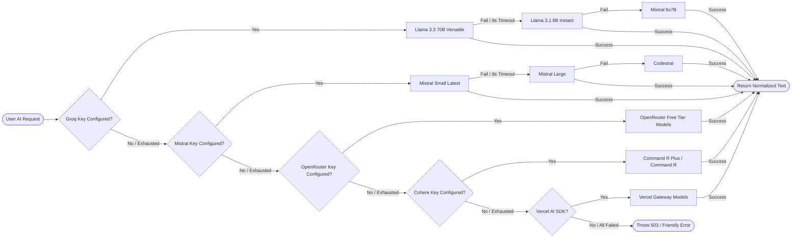

# System Architecture & Technical Topology

This document provides the definitive architectural blueprint, subsystem specifications, data pipelines, and engineering decisions behind **BroFit** (Brother's Fitness ERP & Trainee Portal).

---

## 1. System Topology

BroFit is structured as a decoupled, multi-tier serverless system deployed on Next.js 15 App Router, Supabase PostgreSQL, and Upstash Redis:

```
┌──────────────────────────────────────────────────────────────────────────────────────────────────┐
│                                       BROFIT SYSTEM TOPOLOGY                                     │
├──────────────────────────────────────────────────────────────────────────────────────────────────┤
│                                                                                                  │
│   PUBLIC TRAINEES (Web / PWA)                        ADMINISTRATORS (Management Console)         │
│   • Google OAuth Sign-In                             • Passcode Authentication (Master Secret)   │
│   • Trainee Profile & AI Credits                     • HMAC-SHA256 Bearer Token (24h TTL)        │
│   • Diet Synthesizer & Chatbot                       • Member CRUD, Leads CRM, Audit, Backups    │
│                  │                                                      │                        │
│                  ▼                                                      ▼                        │
│   ┌──────────────────────────────────────────────────────────────────────────────────────────┐   │
│   │                               NEXT.JS 15 APP ROUTER RUNTIME                              │   │
│   │                                                                                          │   │
│   │   [PUBLIC & TRAINEE API ROUTES]               [ADMIN PROTECTED ROUTES (/api/admin/*)]    │   │
│   │   • /api/chat        • /api/contact           • requireAdminToken() Guard                │   │
│   │   • /api/generate-diet                        • /api/admin/login     • /api/admin/backup │   │
│   │   • /api/exercises/ninjas                     • /api/admin/members   • /api/admin/upload │   │
│   │   • /api/public/member-count                  • /api/admin/leads     • /api/admin/logout │   │
│   │   • /api/rate-limit-status                    • /api/admin/activity-logs                 │   │
│   │   • /api/health                               • /api/admin/verify                        │   │
│   │                                                                                          │   │
│   │   [CRON ROUTE]                                                                           │   │
│   │   • /api/cron/monthly-revenue (Protected by CRON_SECRET & timingSafeEqual)                │   │
│   └───────────────┬──────────────────────────┬───────────────────────────────┬───────────────┘   │
│                   │                          │                               │                   │
│                   ▼                          ▼                               ▼                   │
│   ┌───────────────────────────────┐ ┌───────────────────────────────┐ ┌──────────────────────┐  │
│   │       SUPABASE POSTGRES       │ │      UPSTASH REDIS / MEM      │ │  AI FALLBACK ENGINE  │  │
│   │ • public.users (RLS)          │ │ • Sliding-Window Rate Limit   │ │ 1. Groq (Llama 3.3)  │  │
│   │ • public.gym_members          │ │ • Admin Revocation Blacklist  │ │ 2. Mistral AI        │  │
│   │ • public.contact_submissions  │ │   (brofit:admin:revoked-      │ │ 3. OpenRouter        │  │
│   │ • public.admin_activity_logs  │ │    nonces set)                │ │ 4. Cohere            │  │
│   │ • public.app_settings         │ │                               │ │ 5. Vercel AI         │  │
│   │ • Storage: member-photos,     │ │                               │ │ (8s call timeout /   │  │
│   │   backups                     │ │                               │ │  60s total deadline) │  │
│   │ • RPC: spend_user_credit()    │ │                               │ │                      │  │
│   │ • RPC: reset_daily_credits()  │ │                               │ │                      │  │
│   └───────────────────────────────┘ └───────────────────────────────┘ └──────────────────────┘  │
│                                                                                                  │
└──────────────────────────────────────────────────────────────────────────────────────────────────┘
```

---

## 2. Separation of Concerns: Trainee Portal vs. Admin ERP

The codebase maintains strict isolation between client-facing fitness tools and administrative gym operations:

```
brofit/
├── app/
│   ├── (public & trainee routes)    # /, /fuel, /workouts, /calculators, /pricing, /quotes
│   ├── admin/                       # /admin/dashboard, /admin/members, /admin/leads, etc.
│   └── api/
│       ├── (trainee & public APIs)  # /api/chat, /api/generate-diet, /api/contact
│       └── admin/                   # /api/admin/members, /api/admin/backup, /api/admin/upload
├── components/
│   ├── features/ & public/          # Trainee UI (Diet builder, workout stopwatch, hero)
│   └── admin/                       # Admin UI (Member modals, receipts, analytics charts)
└── lib/
    ├── credit-service.ts            # Trainee credit management
    └── admin-auth.ts                # Admin token verification guard
```

### A. Trainee Application Layer
- **Target Audience**: Gym members, prospective trainees, and fitness enthusiasts.
- **Client State**: Local state managed via React hooks; persistence via browser `localStorage` (gamification streaks, diagnostic history, exercise bookmarks).
- **Access Boundary**: Unauthenticated public visitors or authenticated trainees via Google OAuth. Read/write capabilities strictly bound to user's personal UUID through Supabase Row Level Security.

### B. Gym Administration ERP Layer
- **Target Audience**: Gym owners, floor managers, and front-desk personnel.
- **Client State**: Server-synchronized via SWR; session credentials scoped exclusively to browser `sessionStorage`.
- **Access Boundary**: Gated behind `requireAdminToken()` verifying cryptographic signatures and Upstash Redis revocation status. All data operations utilize the server-side `SUPABASE_SERVICE_ROLE_KEY`.

### Visual Separation of Concerns

| **Trainee Experience: Tactical Fuel** | **Administration: ERP Console** |
| :---: | :---: |
| [](./assets/ios-fuel-preview.svg) | [](./assets/ios-admin-preview.svg) |

---

## 3. Subsystem Architecture

### 1. Multi-Provider AI Fallback Cascade (`lib/ai-provider.ts`)
To achieve zero downtime and eliminate vendor lock-in or rate-limit lockouts, all AI generation tasks route through a 16-model cascade spanning 5 independent providers:



- **Per-Model Execution Timeout**: 8,000 ms strict deadline per attempt using `AbortController` to abort stalled serverless invocations.
- **Global Cascade Deadline**: 60,000 ms ceiling across all attempts.
- **Fail-Fast Provider Bypass**: Providers without valid API keys configured in environment variables are skipped instantaneously with zero HTTP overhead.
- **Structured Schema Validation**: Raw model outputs are validated against Zod schemas (`DietResponseSchema`), automatically extracting JSON payloads from markdown code blocks (` ```json ... ``` `).

### 2. Quota & Credit Management Engine (`lib/credit-service.ts`)
Trainee interactions are governed by an Indian Standard Time (IST) quota system resetting daily at midnight IST (5:30 AM UTC):

```
┌──────────────────────────────────────────────────────────────────────────────────────────────────┐
│                                      IST CREDIT SPEND CYCLE                                      │
├──────────────────────────────────────────────────────────────────────────────────────────────────┤
│                                                                                                  │
│   1. Request Arrives at /api/generate-diet or /api/chat with Bearer User JWT                     │
│   2. Server validates token via supabase.auth.getUser() -> obtains userId                        │
│   3. Fetch current user state from public.users:                                                 │
│      • If last_credit_reset < istToday() -> Display credits as MAX_DAILY_CREDITS (default 5)     │
│      • Else -> Display remaining stored daily_credits                                            │
│   4. Server invokes Supabase RPC: spend_user_credit(p_uid, p_max)                                │
│      • Stored Procedure executes atomically inside PostgreSQL transaction:                       │
│        - If last_credit_reset != CURRENT_DATE AT TIME ZONE 'Asia/Kolkata':                       │
│            daily_credits := p_max - 1, last_credit_reset := IST Today                            │
│        - Else if daily_credits > 0:                                                              │
│            daily_credits := daily_credits - 1                                                    │
│        - Else:                                                                                   │
│            RAISE EXCEPTION 'INSUFFICIENT_CREDITS' (returns 402)                                  │
│   5. Transient Network Failure Reconciliation:                                                   │
│      • If RPC call drops, server re-verifies balance before retrying to prevent double-deduction.│
│   6. Background Cron Reset:                                                                      │
│      • Scheduled reset_daily_credits() procedure runs at 5:30 AM IST (Midnight IST boundary)    │
│        reading cap dynamically from public.app_settings.max_daily_credits.                       │
│                                                                                                  │
└──────────────────────────────────────────────────────────────────────────────────────────────────┘
```

---

## 4. Key Engineering Decisions & Architectural Trade-offs

| Decision | Chosen Solution | Alternative Evaluated | Rationale & Trade-offs |
| :--- | :--- | :--- | :--- |
| **Database & Auth Engine** | **Supabase (PostgreSQL 15)** | Firebase Firestore / MongoDB | Relational consistency is mandatory for member lifecycles, billing dates, and transactions. PostgreSQL provides native Row Level Security (RLS) and ACID transactions via stored procedures (`spend_user_credit`). |
| **Admin Authentication** | **Stateless HMAC-SHA256 + Redis Revocation** | Stateful Server Sessions (Express/Session) | Works seamlessly across serverless edge lambdas without sticky sessions. Token nonces are checked against an Upstash Redis blacklist upon logout, combining stateless horizontal scale with instantaneous revocation. |
| **Rate Limiting** | **Upstash Redis Sliding-Window** | Memory-only limiter | Serverless instances on Vercel spin up and down unpredictably. A distributed Redis window ensures login and contact form brute-force limits (5/15m) are strictly enforced across all serverless regions. |
| **Diet Synthesis Engine** | **16-Model Cascade Across 5 Providers** | Single OpenAI API model | Eliminates single-point-of-failure outages and upstream 429 rate limits. Each call enforces an 8s strict timeout before cascading to the next provider, validated at runtime with Zod schemas. |
| **Member Photo Storage** | **Supabase Storage + Magic-Byte Sniffing** | Base64 strings in DB | Storing images directly in PostgreSQL balloons DB size. Uploading compressed WebP/JPEG binaries (<500KB) to Supabase Storage with magic-byte MIME sniffing prevents client spoofing while keeping DB queries instant. |

---

## 5. End-to-End Data Pipelines

### A. Diet Synthesis Pipeline
1. Trainee inputs physical metrics (Age, Gender, Height, Weight, Activity, Dietary preference, Budget) on `/fuel`.
2. Browser sends `POST /api/generate-diet` with the user's Supabase JWT.
3. Server executes atomic stored procedure `spend_user_credit(userId, 5)` in PostgreSQL.
4. Server invokes `generateDietPlan()` triggering the multi-provider cascade.
5. Synthesized JSON is validated via `DietResponseSchema` in Zod.
6. Client renders full macro breakdown, meal timing, and 15-day grocery checklist with bilingual (Hindi/English) toggling and client-side PDF export via `jsPDF` and `html2canvas`.

### B. Member Lifecycle Pipeline
1. Administrator creates or renews a member profile via `MemberFormModal.tsx`.
2. Trainee photo is compressed locally in a Web Worker (< 500 KB, max 1200px) using `browser-image-compression`.
3. Server route `/api/admin/upload` validates magic-byte image signatures and stores the binary in Supabase `member-photos` bucket.
4. Member database record is updated in `public.gym_members` with calculated expiration dates.
5. An immutable audit record is appended to `public.admin_activity_logs`.
