# Security Architecture & Anti-Abuse Hardening

This document provides the definitive specification of all security controls, cryptographic mechanisms, authentication boundaries, and defensive measures implemented across **BroFit**.

---

## 1. Dual-Boundary Authentication Model

BroFit operates two strictly segregated authentication perimeters to ensure complete isolation between public trainees and gym administrators:

```mermaid
flowchart TD
    subgraph MemberAuth["1. Trainee Access Perimeter (Google OAuth + Supabase RLS)"]
        A[Trainee initiates Sign-In] --> B[Supabase Google OAuth Provider]
        B --> C[Receive Supabase JWT Session Token]
        C --> D[Client attaches Bearer JWT in API Calls]
        D --> E[Server verifies token via supabase.auth.getUser]
        E --> F[Resolve user.id and match public.users]
        F --> G[Execute Atomic Credit Deduction via PostgreSQL RPC]
    end

    subgraph AdminAuth["2. Administrative Access Perimeter (Stateless HMAC + Redis Revocation)"]
        H[Admin Submits Master Passcode] --> I[POST /api/admin/login]
        I --> J[timingSafeEqual verification vs ADMIN_PASSWORD]
        J --> K[Mint HMAC-SHA256 Token with 24h Expiry & Nonce]
        K --> L[Client stores Token in sessionStorage]
        L --> M[requireAdminToken guard verifies signature & Redis blacklist]
        M --> N[Authorize Service-Role Supabase Access]
    end
```



### Trainee Authentication
- **Mechanism**: Google OAuth managed by `@supabase/supabase-js` (`lib/user-auth-context.tsx`).
- **Identity Binding**: The `public.users` table is mapped 1:1 with `auth.users` via `auth.uid() = id`.
- **Row Level Security (RLS)**: Trainees are strictly confined to reading and modifying their own profile and credit records.
- **Server Verification**: Protected API routes (`/api/generate-diet`, `/api/chat`) verify the user's JWT server-side via `supabase.auth.getUser(token)` before performing atomic credit transactions.

### Administrative Authentication
- **Mechanism**: Single master passcode verified against `ADMIN_PASSWORD` (or fallback `ADMIN_TOKEN_SECRET`).
- **Constant-Time Verification**: `crypto.timingSafeEqual` prevents timing side-channel attacks by enforcing constant-time comparisons regardless of input length:
  ```typescript
  const passwordBuffer = Buffer.from(password);
  const adminPasswordBuffer = Buffer.from(adminPassword);

  if (passwordBuffer.length === adminPasswordBuffer.length) {
    isValid = timingSafeEqual(passwordBuffer, adminPasswordBuffer);
  } else {
    // Constant-time dummy check to prevent timing leaks on password length
    timingSafeEqual(adminPasswordBuffer, adminPasswordBuffer);
    isValid = false;
  }
  ```
- **Token Structure**: Stateless signed bearer token formatted as `<base64url(payload)>.<signature>` where the payload contains:
  - `iat`: Timestamp when issued (Unix seconds).
  - `exp`: Expiration timestamp (24-hour lifetime).
  - `nonce`: Cryptographically secure random UUID generated via `crypto.randomUUID()`.
- **Client Storage Scoping**: Admin tokens are stored exclusively in browser `sessionStorage` (scoped strictly to the active tab, automatically destroyed on tab close) and never in persistent `localStorage`.
- **Dual-Layer Revocation**: When an administrator logs out via `POST /api/admin/logout`, the token's nonce is blacklisted in both:
  1. An in-memory `Set` with automatic expiry pruning for single-instance development.
  2. An **Upstash Redis** set (`brofit:admin:revoked-nonces`) with a 24-hour TTL for multi-region serverless deployments.
- **Request Guard**: The `requireAdminToken()` middleware helper checks token validity, expiry, cryptographic signature, and Redis blacklist before permitting access to `/api/admin/*`.

---

## 2. Distributed Sliding-Window Rate Limiting

Rate limiting is enforced at the serverless API boundary using `@upstash/ratelimit` with an in-memory sliding-window fallback:

| Endpoint | Limit Preset | Window | Key Identifier | Action on Limit |
| :--- | :--- | :--- | :--- | :--- |
| `POST /api/admin/login` | **5 requests** | 15 minutes | Trusted Client IP | Returns `429 Too Many Requests` with `Retry-After` header |
| `POST /api/contact` | **3 submissions** | 1 hour | Trusted Client IP | Returns `429 Too Many Requests` |
| `POST /api/generate-diet`| **5 credits** | 24 hours (IST) | Trainee UUID | Returns `402 Payment Required` (Insufficient Credits) |
| `POST /api/chat` | **5 credits** | 24 hours (IST) | Trainee UUID | Returns `402 Payment Required` (Insufficient Credits) |

### Trusted Proxy IP Extraction
To prevent header spoofing via fabricated `x-forwarded-for` headers, incoming proxy headers are only honored when running in verified hosting environments (`VERCEL=1` or `TRUST_PROXY_HEADERS=true`):
- Takes the rightmost IP in forwarding chains to circumvent untrusted client-supplied headers.
- Falls back to standard socket address (`127.0.0.1`) during local offline execution.

---

## 3. Input Validation & Defense-in-Depth

### Magic-Byte MIME Signature Sniffing (`/api/admin/upload`)
The avatar upload endpoint rejects client-supplied `Content-Type` headers. Instead, it inspects the initial 8–12 binary bytes of the incoming buffer to detect true file types:

| Image Format | Magic Byte Signature | Status |
| :--- | :--- | :--- |
| **JPEG** | `FF D8 FF` | Accepted |
| **PNG** | `89 50 4E 47 0D 0A 1A 0A` | Accepted |
| **WebP** | `52 49 46 46 .... 57 45 42 50` (`RIFF....WEBP`) | Accepted |
| **AVIF** | `.... 66 74 79 70 61 76 69 66` (`ftypavif`) | Accepted |
| **GIF** | `47 49 46 38 37 61` or `47 49 46 38 39 61` (`GIF87a`/`GIF89a`) | Accepted |
| **All Others** | Executables, SVG, HTML, PHP, shell scripts | **Rejected (400 Bad Request)** |

Additional upload safeguards:
- **Maximum File Size**: 5 MB hard limit enforced prior to buffering.
- **Client Compression**: Web Worker image compression (< 500 KB, max 1200px) prior to upload.

### CSV Formula Injection Neutralization
In administrative CSV exports (`/admin/dashboard` & `/admin/members`), all cell values starting with formula execution characters are neutralized:
- Characters: `=`, `+`, `-`, `@`, `\t`, `\r`, `\n`.
- Neutralization: Prefixed with an escaped leading tab character (`\t`) to force spreadsheet viewers (Excel, Google Sheets, LibreOffice) to treat values as literal strings rather than executable expressions.

### Honeypot Bot Defense (`/api/contact`)
Public inquiry forms include a hidden form field `_honeypot` styled with CSS `display: none` and `opacity: 0`:
- Legitimate human visitors leave this input empty.
- Automated web scrapers populate the field.
- When populated, the server silently aborts database insertion while returning a deceptive `{ success: true }` HTTP 200 response to misdirect attackers without raising alarms.

---

## 4. Operational Telemetry & Audit Trail

### Request Tracing (`lib/request-id.ts`)
- Every incoming request is assigned a unique `x-request-id` header (either preserving client-passed UUIDs if valid or generating fresh cryptographically random UUIDs).
- The identifier is attached to outbound response headers and propagated to all child loggers.

### Structured Logging (`lib/logger.ts`)
- In production (`NODE_ENV=production`), logs are emitted as structured single-line JSON objects containing:
  - `timestamp`: ISO-8601 formatted timestamp.
  - `level`: `info`, `warn`, or `error`.
  - `requestId`: Associated request tracing UUID.
  - `context`: Operational metadata (excluding passwords, tokens, and PII).
- In development, human-readable colorized log lines are emitted.

### Immutable Administrative Audit Log (`public.admin_activity_logs`)
- Every administrative action (`CREATE`, `UPDATE`, `DELETE`, `LOGIN`, `LOGOUT`, `BACKUP`) generates an immutable record capturing:
  - Admin session identifier.
  - Target member or lead identifier.
  - Action summary and structured JSON diff.
  - Client IP address and User-Agent string.
- The table is locked under RLS—direct client inserts, updates, or deletes are permanently revoked.

---

## 5. HTTP Security Headers

BroFit configures strict HTTP security headers in `next.config.mjs` applied globally across all routes:

```javascript
const securityHeaders = [
  { key: 'X-Content-Type-Options', value: 'nosniff' },
  { key: 'X-Frame-Options', value: 'DENY' },
  { key: 'X-XSS-Protection', value: '1; mode=block' },
  { key: 'Referrer-Policy', value: 'strict-origin-when-cross-origin' },
  {
    key: 'Permissions-Policy',
    value: 'camera=(), microphone=(), geolocation=(), browsing-topics=()'
  }
];
```

---

## 6. Privacy & Zero-PII Policy

- **No Public Member Data**: Gym member records, membership dates, contact numbers, and payment details are accessible exclusively through authenticated administrative API endpoints powered by the server-side service-role key.
- **Sanitized Visuals & Mocks**: All documentation, unit tests, and SVG mockups utilize 100% synthetic placeholder records (`Aarav Sharma`, `Rohan Patel`, `Priya Verma`) with mock phone numbers (`+91 98765 00000`).
- **Encrypted In-Transit**: All client-server and server-database communication is strictly encrypted over TLS 1.3.

<div align="center">
  <p><sub><b>Sanitized Administrative Console (Synthetic Placeholders Only)</b></sub></p>
  
</div>

